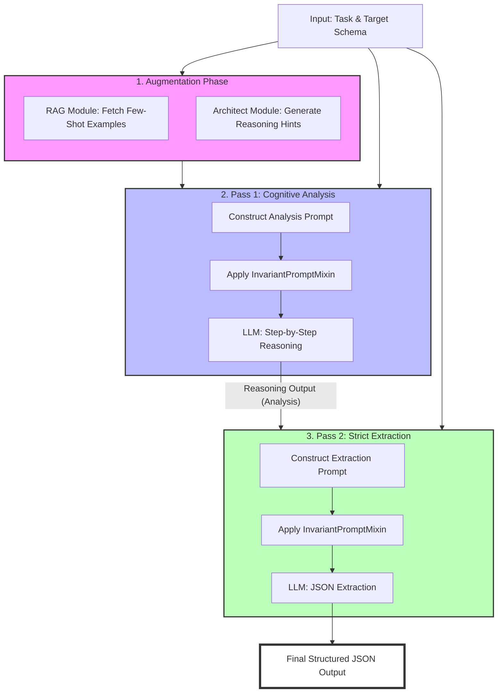

# SlimChampionAgent Architecture

The `SlimChampionAgent` is a streamlined, high-accuracy pipeline designed for Small Language Models (SLMs). It combines Retrieval-Augmented Generation (RAG), cognitive reasoning hints, and a Two-Pass execution strategy to maximize extraction quality while minimizing the latency and cost associated with larger ensembles.

## Workflow Diagram

## Component Overview

### 1. Augmentation Phase
Before any reasoning occurs, the agent enriches the context with two types of external knowledge:
- **RAG Module**: Retrieves the most relevant `k` few-shot examples from the training set. This provides the model with "in-context learning" samples that demonstrate the desired extraction format and style.
- **Architect Module**: Generates high-level strategic "hints" (e.g., "Look for temporal markers", "Distinguish between location and organization"). These hints guide the model's focus during the reasoning phase.

### 2. Pass 1: Cognitive Analysis
The goal of this pass is **reasoning without constraints**.
- **Unconstrained Analysis**: The model is asked to perform a step-by-step analysis in a specific reasoning language (e.g., Spanish). This forces the model to use more "cognitive cycles" on the problem before attempting to format the output.
- **Invariant Injection**: The `InvariantPromptMixin` adds critical rules like the "Extract-or-Null" instruction, ensuring the model remains grounded in the text even during analysis.

### 3. Pass 2: Strict Extraction
The goal of this pass is **syntax-constrained formatting**.
- **Contextual Extraction**: The model receives the original input text AND the detailed analysis produced in Pass 1.
- **Strict Schema Enforcement**: Using the `json_schema` response format, the model maps its previously generated reasoning into the final structured format.
- **Final Invariants**: Re-applies the "Extract-or-Null" rule to ensure that if the reasoning identified a field as missing, it is correctly output as `null` in the JSON.

## Key Benefits
- **Lower Latency**: By avoiding multiple ensemble rounds or complex auditing loops, it remains fast enough for production SLM use.
- **Higher Grounding**: The "Null Rule" invariant significantly reduces hallucinations by giving the model a safe exit when data is missing.
- **Cross-Lingual Reasoning**: Reasoning in a different language than the target output can sometimes bypass linguistic biases in the model's training data.
