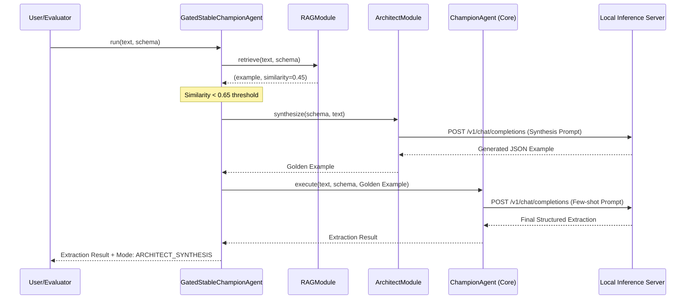

# Architectural Design & Workflow: Architect Few-Shot Fallback

## 1. Overview
The **Architect Few-Shot Fallback** is a strategic enhancement for the `GatedStableChampionAgent` in the GenSIE challenge. The core objective is to improve extraction quality when the RAG (Retrieval-Augmented Generation) component fails to find a high-similarity example (similarity < 0.65). Instead of defaulting to a potentially unstable zero-shot prompt, the system invokes the `ArchitectModule` to synthesize a "golden example" tailored to the specific schema and input text.

## 2. Decision Logic (Conditional Pivot)
The `run` method of the `GatedStableChampionAgent` implements the logic for selecting between RAG-based few-shot, Architect-synthesized few-shot, and (optionally) zero-shot modes.

### Implementation Snippet
```python
def run(self, input_text, schema):
    """
    Executes the extraction workflow with a gated fallback to synthesis.
    """
    # Step 1: Attempt retrieval via RAG
    retrieved_example, similarity = self.rag_module.retrieve(input_text, schema)
    
    # Step 2: Conditional Pivot
    if similarity >= self.threshold:
        # High-confidence RAG hit
        active_example = retrieved_example
        execution_mode = "RAG_FEW_SHOT"
    else:
        # Fallback: Synthesize a golden example
        # This replaces the previous 'zero-shot' default
        active_example = self.architect_module.synthesize(schema, input_text)
        execution_mode = "ARCHITECT_SYNTHESIS_FEW_SHOT"
    
    # Step 3: Primary Extraction Pass
    # The Champion Agent uses the selected example in its few-shot prompt
    prediction = self.champion_agent.execute(
        text=input_text, 
        schema=schema, 
        few_shot_example=active_example
    )
    
    return {
        "prediction": prediction,
        "metadata": {
            "mode": execution_mode,
            "similarity": similarity
        }
    }
```

## 3. Workflow Sequence Diagram
The following diagram illustrates the interactions between the components during a fallback scenario.



## 4. Resource Budget: Synthesis Pass Tokens
The GenSIE challenge imposes a strict **32,000 token limit** per instance. A synthesis pass adds a precursor LLM call, increasing total consumption.

| Component | Estimated Tokens (Min) | Estimated Tokens (Max) | Notes |
| :--- | :--- | :--- | :--- |
| **Schema Definition** | 1,000 | 5,000 | Can be large for complex domains. |
| **Input Text** | 500 | 10,000 | GenSIE inputs vary significantly. |
| **Synthesis Prompt** | 300 | 500 | System instructions for the Architect. |
| **Generated Example** | 500 | 2,000 | The synthetic "golden" pair. |
| **Total (Synthesis Pass)** | **2,300** | **17,500** | First LLM call. |
| **Few-Shot Prompt** | 2,000 | 17,000 | Schema + Example + Input. |
| **Final Extraction** | 500 | 2,000 | The JSON result. |
| **Total (Combined)** | **4,800** | **21,500** | (Synthesis + Extraction). |

**Conclusion:** The Synthesis Pass fits within the **32K limit**. Even in "worst-case" scenarios (large schema + long text), the pipeline typically stays under 22K tokens, leaving a ~10K token safety margin for reasoning/CoT.

## 5. Offline Constraints & Infrastructure
*   **Isolation:** The GenSIE environment is strictly offline.
*   **Inference Server:** The `ArchitectModule` must connect to the same local endpoint (e.g., `http://localhost:8000/v1`) provided by the organizers.
*   **Model Reuse:** To stay within the memory constraints of the competition (often limited VRAM), the `ArchitectModule` should ideally utilize the same model instance as the `ChampionAgent` (e.g., Qwen-14B or Llama-3-8B).
*   **Latency:** The fallback adds one full round-trip to the inference server. In a time-constrained environment, this is the primary trade-off vs. zero-shot.
