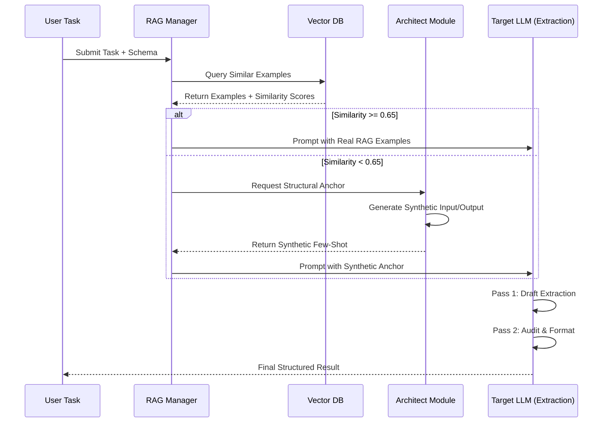

# Research Question 1: Conceptual Architecture & Workflow of the Architect Few-Shot Fallback

## 1. Workflow Definition: Task to Extraction
The Architect Few-Shot Fallback is a contingency mechanism designed to maintain structural integrity when traditional Retrieval-Augmented Generation (RAG) fails to provide high-quality reference examples.

### The Lifecycle of an Extraction Request:
1.  **Task Initiation**: The system receives a raw text input and a target schema (e.g., JSON schema for entity extraction).
2.  **RAG Search**: The system queries a vector database for historical examples of similar extractions.
3.  **Threshold Evaluation**:
    *   The system calculates the similarity score (cosine similarity) between the current task and the retrieved examples.
    *   **Condition**: If `Similarity < 0.65`.
4.  **Architect Synthesis (The Fallback)**:
    *   Instead of defaulting to a Zero-Shot prompt (which often leads to schema violations or hallucinations), the **ArchitectModule** is invoked.
    *   The ArchitectModule takes the target schema and generates a **Synthetic Input/Output Pair**.
    *   The synthetic pair demonstrates how a hypothetical input should be mapped to the target schema, effectively acting as a "Golden Template."
5.  **Two-Pass Extraction**:
    *   **Pass 1 (Drafting)**: The LLM generates a draft extraction using the synthetic example as a few-shot anchor.
    *   **Pass 2 (Auditing)**: A separate "Auditor" pass refines the draft, ensuring all fields in the schema are present and correctly formatted.

## 2. Comparison: "Real RAG" vs. "Synthetic Architect"

| Feature | Real RAG (Semantic Focus) | Synthetic Architect (Structural Focus) |
| :--- | :--- | :--- |
| **Source** | Historical human-verified data. | Programmatically generated by the ArchitectModule. |
| **Primary Value** | **Semantic Accuracy**: Provides domain-specific nuance and actual facts. | **Structural Grounding**: Provides a rigid template for schema adherence. |
| **Risk Profile** | High variability; can introduce "semantic drift" if example is slightly irrelevant. | Low factual value; purely focused on output format and field mapping. |
| **Typical Trigger** | Similarity Score $\ge 0.65$. | Similarity Score $< 0.65$ (Fallback). |
| **Analogy** | Learning from a colleague's past report. | Learning from a blank template with "Sample Data". |

## 3. Mermaid Sequence Diagram: Decision Logic

## 4. Why Synthetic Examples act as "In-Context Weights"

The "Architect Few-Shot Fallback" leverages the concept of **In-Context Weights** (or Implicit Optimization). When an LLM processes few-shot examples, it doesn't just read them as text; it uses its attention mechanism to perform a process mathematically equivalent to **Implicit Gradient Descent**.

### The Mechanics of "Soft Priors":
*   **Schema Priming**: By providing even a synthetic example, the model "calculates" a temporary set of internal weights that favor the specific structure of the schema. This biases the attention layers to focus on "Key: Value" relationships defined in the example.
*   **Structural Anchoring**: In Zero-Shot mode, the model's output distribution is broad, leading to potential "creativity" (hallucination). The synthetic example acts as a **Structural Anchor**, narrowing the probability distribution toward the desired JSON/Markdown structure.
*   **Functional Mapping**: The synthetic example teaches the model the *function* of the task (e.g., "Extract Dates into YYYY-MM-DD format") rather than providing the *data*. This "functional weighting" ensures that even if the content is new, the transformation logic is pre-optimized in the context window.

In essence, synthetic examples serve as **"Structural Meta-Data"** that stabilizes the model's reasoning process, preventing the "Recall Drop" typically seen in Zero-Shot transitions.
