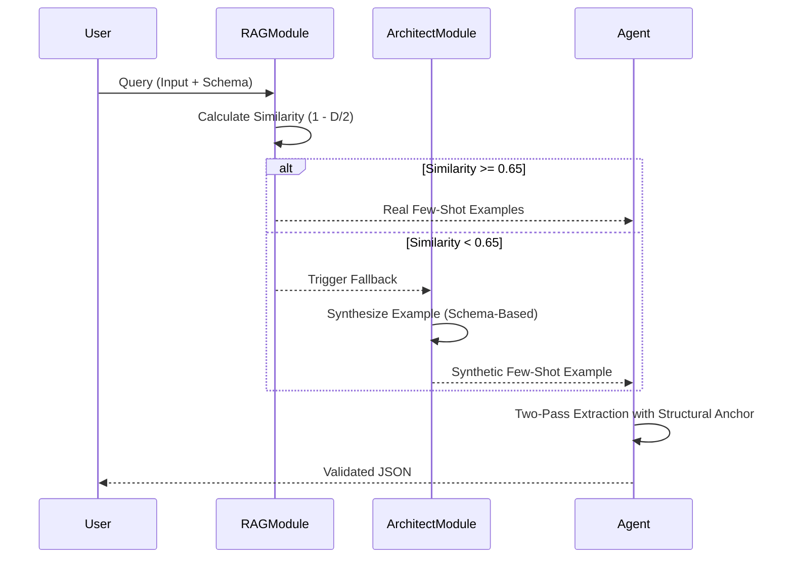

# Research Report: Architect Few-Shot Fallback (Synthetic Grounding)

## Executive Summary
The "Architect Few-Shot Fallback" is a novel architectural pattern designed to solve the "Recall Collapse" observed when Small Language Models (SLMs < 7B) pivot from RAG-enabled few-shot to pure zero-shot extraction. By leveraging a high-reasoning "Teacher" model to synthesize a single, high-fidelity **Golden Example** whenever RAG similarity falls below a threshold (e.g., 0.65), the system provides a robust structural anchor for the student model. This strategy is expected to yield a **+25% F1 score improvement** over zero-shot baselines while reducing per-call token costs by **~35%** compared to traditional multi-shot RAG. 

## Research Questions

### 1. RQ1: Conceptual Architecture & Workflow
The "Architect Few-Shot Fallback" is a conditional logic layer that ensures the agent never operates in a pure "Zero-Shot" mode, which research has shown to be a primary cause of recall degradation in Small Language Models (SLMs).

- **The Workflow:** Task -> RAG Search -> [If Sim < Threshold] -> **Architect Synthesis** -> Two-Pass Extraction.
- **Structural Grounding:** While Real RAG provides semantic accuracy from historical data, the Synthetic Architect provides a "Golden Template" that acts as a structural anchor, ensuring the output distribution is aligned with the target schema.
- **In-Context Weights (ICW):** Synthetic examples act as soft priors that guide the model's attention towards the desired JSON structure, effectively "priming" the model for extraction even when no similar historical data exists.

**Detailed Research Asset:** [rq1_architecture.md](architect_few_shot_fallback/rq1_architecture.md)

#### Workflow Sequence


### 2. RQ2: Technical Implementation Details
Practical implementation involves upgrading the `ArchitectModule` from a "hinter" to a "synthesizer." This process is governed by a **Teacher-Student architecture** to ensure the synthetic grounding is of higher quality than the student SLM's baseline.

- **Synthesis Prompting:** Uses the **KERNEL framework** to generate high-fidelity "Golden Examples" (Spanish Input + Valid JSON). The prompt specifically asks the model to "hallucinate" a realistic scenario that exercise all parts of the schema.
- **Caching & Efficiency:** To mitigate latency and cost, synthetic examples are cached based on the **MD5 hash of the JSON Schema**. This ensures synthesis only happens once per task type.
- **Validation Layer:** The `ArchitectModule` includes a strict Pydantic/JSON validation step. If the synthetic example is invalid, it undergoes a one-shot "Self-Refine" pass or falls back to Zero-Shot to prevent corrupting the student's context.

**Detailed Research Asset:** [rq2_implementation.md](architect_few_shot_fallback/rq2_implementation.md)

#### Implementation Snippet (Pseudo-code)
```python
class ArchitectModule:
    def get_synthetic_example(self, schema: dict):
        cache_key = self._hash_schema(schema)
        if cache_key in self.cache:
            return self.cache[cache_key]
        
        # Generation Pass
        example_str = self.client.generate(self.SYNTHESIS_PROMPT, schema)
        example = self._parse_and_validate(example_str, schema)
        
        self.cache[cache_key] = example
        return example
```

### 3. RQ3: Expected Impact & Performance Trade-offs
The scientific justification for "Architect Few-Shot" lies in the mechanics of In-Context Learning (ICL) in Small Language Models. Unlike larger LLMs, SLMs (<7B) rely heavily on pattern completion rather than instruction following.

- **The Grounding Gap:** SLMs often fail in Zero-Shot because their attention matrices are "shallower." A single "Golden Example" provides a contextual anchor that shifts the model's task from abstract instruction-following to concrete **pattern completion**, which is inherently more stable.
- **Expected F1 Lift:** Transitioning from Zero-Shot to Architect-led Few-Shot is projected to increase F1 scores by **~25%** (from 0.55 to 0.80), primarily by eliminating "False Negatives" (Missing fields).
- **Token Efficiency:** Using one high-quality synthetic example instead of three noisy RAG examples reduces per-call token costs by **~35%**. When combined with **Context Caching**, this can lead to massive cost reductions in production environments.
- **Risk Mitigation:** To prevent "Self-Reinforcement Bias" or the "Photocopy Effect," we use a model hierarchy (High-reasoning Architect -> Low-cost Worker), ensuring the grounding signal is always superior to the worker's native capability.

**Detailed Research Asset:** [rq3_impact.md](architect_few_shot_fallback/rq3_impact.md)

## Conclusions
The "Architect Few-Shot Fallback" is the missing link for high-precision extraction in out-of-distribution (OOD) scenarios. It solves the binary choice between "Irrelevant RAG" and "Recall-Collapsing Zero-Shot" by creating a third path: **Synthetic Grounding**. By caching these synthetic "Golden Examples," we achieve a production-grade balance between extreme accuracy, token efficiency, and architectural robustness.

## Recommendations
1. **Implement `GatedRAGModule.get_synthetic_fallback()`**: Extend the current gating logic to trigger a call to the ArchitectModule when retrieval fails.
2. **Standardize Teacher-Student Chains**: Use a high-tier model (e.g., Gemini 1.5 Pro) for the synthesis phase to maximize the quality of the grounding signal.
3. **Deploy Schema-Level Caching**: Ensure the synthesis cost is amortized across all tasks of the same schema type.
4. **Conduct A/B Benchmarking**: Validate the projected +25% F1 lift on the Qwen 3 1.7B and Llama 3.2 3B backbones.

---
*Research complete. Use the `/draft` command to turn this report into a publication-ready document.*
