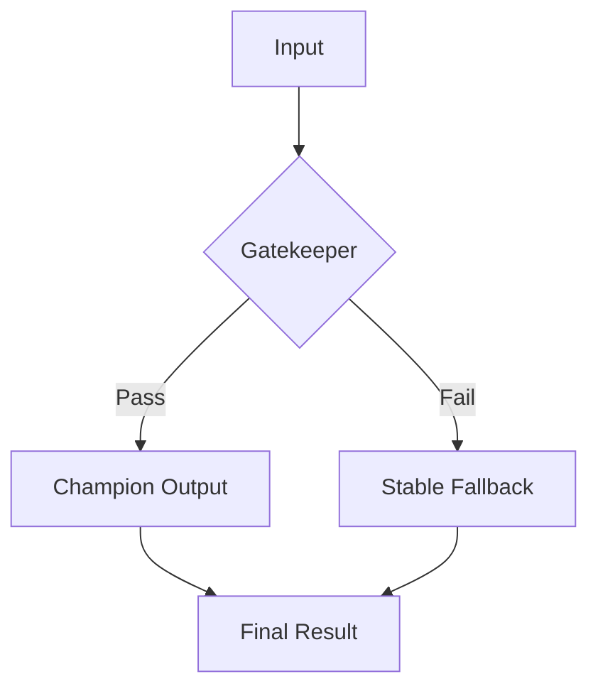

# GenSIE Agent Branding & Documentation Strategy

This document outlines an optimal Markdown documentation strategy for presenting the AI agent identities (M.I.R.A., V.I.G.I.L., A.R.C.A.N.E.) within the GenSIE ecosystem to corporate and technical stakeholders.

## 1. Product Branding Layouts for Technical Documentation

To bridge the gap between business value and technical implementation, we propose a three-tiered layout strategy:

### A. Feature Cards (Corporate Stakeholders)
Visual, high-level cards that define the "Job Description" of the agent.
*   **Structure:** Name, Codename, Primary Goal, Key Value Prop (e.g., "Reduces hallucination by 40%").
*   **Visual Style:** Use a blockquote or a bordered div with a distinct emoji/icon.

### B. Specification Sheets (Architects & Tech Leads)
Detailed technical breakdowns of the underlying logic and constraints.
*   **Structure:** Architecture Type (e.g., Two-Pass), Hardware Requirements, Tooling Inventory, and Failure Modes.
*   **Best Practice:** Include a "Constraints" section to manage expectations on what the agent *cannot* do.

### C. Capability Matrix (Decision Makers)
A side-by-side comparison table for quick evaluation of trade-offs.
*   **Columns:** Agent, Latency, Accuracy, Cost, Primary Use Case.
*   **Goal:** Allow stakeholders to choose the right "tool for the job" based on their specific constraints.

---

## 2. Agent Identities & Personas

### **M.I.R.A. (two-pass-null)**
*   **Full Name:** Multimodal Information Retrieval Agent
*   **Persona:** "The Scalpel" — Focused on precision through iterative refinement.
*   **Technical Strategy:** Implements a **Two-Pass** architecture where the first pass extracts context and the second pass executes the schema mapping. The "null" suffix indicates a self-correction loop without an external auditor.
*   **Primary Value:** Highest semantic grounding for complex, unseen schemas.

### **V.I.G.I.L. (gated-stable-champion)**
*   **Full Name:** Validation & Integrity Guardian for Integrated Logic
*   **Persona:** "The Shield" — Focused on production reliability and safety.
*   **Technical Strategy:** A **Gated** system that routes requests to a "Champion" model but validates the output via a "Gatekeeper." If the output fails validation, it falls back to a "Stable" baseline.
*   **Primary Value:** Zero-downtime reliability; prevents catastrophic schema violations in production.

### **A.R.C.A.N.E. (audited-synthetic)**
*   **Full Name:** Audited Reasoning & Complex Analytic Network Engine
*   **Persona:** "The Forge" — Focused on reasoning and optimization for rare edge cases.
*   **Technical Strategy:** Uses **Synthetic** generation to explore the reasoning space (MCTS-guided) followed by an **Audit** pass that filters for the highest-quality output.
*   **Primary Value:** Superior performance on low-data or highly complex reasoning tasks.

---

## 3. Architectural Traceability (Linking Code to Branding)

To maintain a "single source of truth," the documentation must link directly to the implementation in `src/gensie/`.

### Mapping Strategy
We recommend a **Traceability Matrix** at the end of the documentation to guide developers:

| Branded Agent | Technical Strategy | Primary Entry Point | Core Logic File |
| :--- | :--- | :--- | :--- |
| **M.I.R.A.** | `two-pass-null` | `MIRA() -> BaseAgent` | `src/gensie/baseline.py` |
| **V.I.G.I.L.** | `gated-stable-champion` | `VIGIL() -> GatedAgent` | `src/gensie/baseline.py` |
| **A.R.C.A.N.E.** | `audited-synthetic` | `ARCANE() -> AuditedAgent` | `src/gensie/baseline.py` |

### Implementation Best Practices:
1.  **Relative Linking:** Use `[src/gensie/baseline.py](../src/gensie/baseline.py)` to allow navigation from within GitHub or VS Code.
2.  **Docstring Synchronization:** Use MkDocs with the `mkdocstrings` plugin to inject actual Python class definitions and docstrings directly into the `AGENTS.md` file.
    ```markdown
    ::: gensie.baseline.BaseAgent
        options:
          show_source: true
    ```
3.  **Code Annotations:** Use the `::: (L42-L55)` syntax to link to specific lines of the gating logic in V.I.G.I.L. or the synthesis pass in A.R.C.A.N.E.

---

## 4. Visual Aids & Performance Trade-offs

Visuals are mandatory for presenting the **Speed vs. Precision** trade-off inherent in different agent architectures.

### A. Pareto Frontier (Scatter Plot)
*   **X-Axis:** Latency (Tokens per Second / TPS)
*   **Y-Axis:** Extraction Accuracy (F1 / Schema Match)
*   **Placement:**
    *   **V.I.G.I.L.:** High speed (if Champion succeeds), High stability.
    *   **M.I.R.A.:** Moderate speed, High precision.
    *   **A.R.C.A.N.E.:** Lower speed (due to audit/synthesis), Maximum precision.

### B. Mermaid Logic Flows
Use Mermaid.js to visualize the decision logic for technical stakeholders.
*   **Example (V.I.G.I.L.):**


### C. Radar Chart
Compare agents across 5 axes: **Speed, Cost-Efficiency, Reliability, Reasoning Depth, and Schema Versatility.**

---

## 5. Proposed 'AGENTS.md' Layout

```markdown
# GenSIE Agent Roster

## Overview
Brief introduction to the GenSIE ecosystem and the design philosophy (Speed vs. Precision).

## The Agents

### [Icon] M.I.R.A.
*The Precision Instrument*
- **Strategy:** Two-Pass Iteration
- **Best For:** Unseen schemas, long-form extraction.
- **Link:** [Implementation Details](#mira-specs)

### [Icon] V.I.G.I.L.
*The Production Guardian*
- **Strategy:** Gated Stable-Champion
- **Best For:** High-stakes production, safety-critical tasks.
- **Link:** [Implementation Details](#vigil-specs)

### [Icon] A.R.C.A.N.E.
*The Reasoning Engine*
- **Strategy:** Audited Synthetic Exploration
- **Best For:** Complex logic, low-data environments.
- **Link:** [Implementation Details](#arcane-specs)

## Performance Comparison
[Insert Pareto Chart Image]
[Insert Capability Matrix Table]

## Technical Specifications
### M.I.R.A. Technical Deep-Dive <a name="mira-specs"></a>
- Architecture: `two-pass-null`
- Source: `src/gensie/baseline.py`
... (continue for others)
```

---
**Summary for Stakeholders:**
By using this strategy, GenSIE documentation transforms from a static reference to a dynamic product guide that addresses the ROI concerns of corporate leaders while providing the precision needed by engineering teams.
