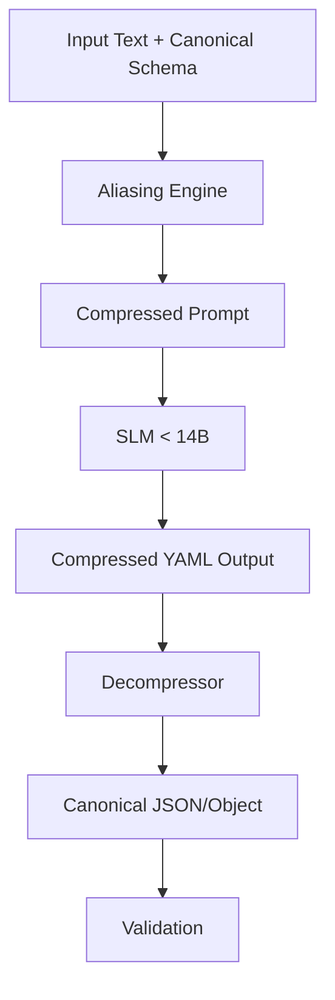

# The Compressed-YAML Specialist: Design Document

## 1. Overview
The **Compressed-YAML Specialist** is a specialized extraction agent designed to maximize the "Token-Density" of SLM outputs. By leveraging YAML's lack of syntactic noise and implementing a custom "Key Aliasing" protocol, this agent aims to reduce output token overhead by **20-30%** without sacrificing extraction accuracy.

This agent is particularly effective for models with smaller context windows or those sensitive to high-frequency token repetition (e.g., repeating long schema keys 50+ times in a large list).

## 2. Architecture
The agent operates in a three-stage pipeline:

1.  **Aliased Prompting (LLM):** The model receives a schema mapped to 1-3 letter aliases and is instructed to output minified YAML.
2.  **Structural Decompression (Code):** A post-processor maps the short-form keys back to the canonical schema.
3.  **Validation (Pydantic):** The decompressed object is validated against the original Pydantic/JSON-Schema.



## 3. Optimization Strategies

### 3.1 Token-Dense Formatting (YAML vs. JSON)
YAML is used as the primary output format because:
- **No Braces/Commas:** Removes significant token overhead per field.
- **Optional Quoting:** Most strings and all keys do not require quotes, saving 2 tokens per field.
- **Indentation-based:** Uses whitespace which is often handled more efficiently by modern BPE tokenizers (like Llama-3's) compared to repetitive punctuation.

### 3.2 Key Aliasing (The Mapping Protocol)
To minimize the "schema tax," all keys are mapped to 1-2 character aliases. 

**Mapping Logic:**
- **Primary Fields:** Single letters (e.g., `name` -> `n`, `value` -> `v`).
- **Nested/Specific Fields:** Two-letter mnemonic aliases (e.g., `pathology_name` -> `pn`).
- **Lists:** Standard YAML list bullets (`- `) are used, which are highly token-efficient.

### 3.3 Minification & Whitespace Optimization
- **2-Space Indent:** Provides the minimum structural clarity for YAML parsing.
- **Flow Style for Enums:** Uses `[a, b, c]` for small arrays instead of block style to save newline tokens.
- **Omission of Defaults:** Instructions to omit fields with `null` or empty values to further reduce density.

## 4. Prompt Template

### System Prompt
```markdown
You are a High-Density Extraction Engine. Your goal is to extract structured data into COMPRESSED YAML format using the provided ALIAS MAP.

### ALIAS MAP
{alias_map_markdown}

### OUTPUT CONSTRAINTS
1. Format: YAML only.
2. Keys: Use ONLY the aliases provided in the map.
3. Strings: Do NOT use quotes unless the string contains a colon followed by a space ": ".
4. Whitespace: Use exactly 2 spaces for indentation.
5. Omission: If a field is missing or null in the source text, do NOT include the key.
6. Flow Style: Use [item1, item2] for lists with < 3 items.

### SOURCE TEXT
{source_text}

### EXTRACTION
```

### Example Mapping (Internal Context)
*Canonical:* `{"medical_report": {"patient_name": "...", "diagnosis": "...", "medications": ["...", "..."]}}`
*Aliased Map:*
- `mr`: medical_report
- `pn`: patient_name
- `d`: diagnosis
- `m`: medications

*Output:*
```yaml
mr:
  pn: John Doe
  d: Acute Pharyngitis
  m: [Amoxicillin, Ibuprofen]
```

## 5. Implementation Details

### 5.1 Decompression Logic
The decompressor is a recursive Python function that swaps keys:
```python
def decompress(data, alias_map):
    reverse_map = {v: k for k, v in alias_map.items()}
    if isinstance(data, dict):
        return {reverse_map.get(k, k): decompress(v, alias_map) for k, v in data.items()}
    if isinstance(data, list):
        return [decompress(i, alias_map) for i in data]
    return data
```

### 5.2 SLM Performance Considerations
For models < 14B (like Llama-3-8B or Mistral-7B), semantic grounding is maintained by providing the full descriptive name in the `ALIAS MAP`. This ensures the model associates the short key `pn` with the concept of "Patient Name" during the attention pass.

## 6. Benchmarking Hypotheses

| Metric | Target | Rationale |
| :--- | :--- | :--- |
| **Token Reduction** | 25% | Elimination of `"`, `{`, `}`, `,` and shortening of long keys. |
| **Extraction Accuracy** | +/- 2% | YAML's structure is more similar to model training data (Markdown/Python) than minified JSON. |
| **Latency** | -15% | Fewer tokens generated leads directly to faster Time-To-Last-Token (TTLT). |
| **Parsing Error Rate** | < 1% | YAML parsers are robust to minor indentation errors; regex can fix common "trailing colon" issues. |

## 7. Risks & Mitigations
- **Risk:** Model reverts to long-form keys.
  - **Mitigation:** Strict negative constraints in the prompt and 2-shot examples.
- **Risk:** YAML indentation errors in deep nesting.
  - **Mitigation:** Limit nesting depth to 3 levels; flatten schema where possible.
- **Risk:** Tokenizer-specific issues (e.g., some tokenizers might treat `pn:` as a single token).
  - **Mitigation:** Test with specific model tokenizers to ensure the colon isn't being merged in a way that breaks parsing.
