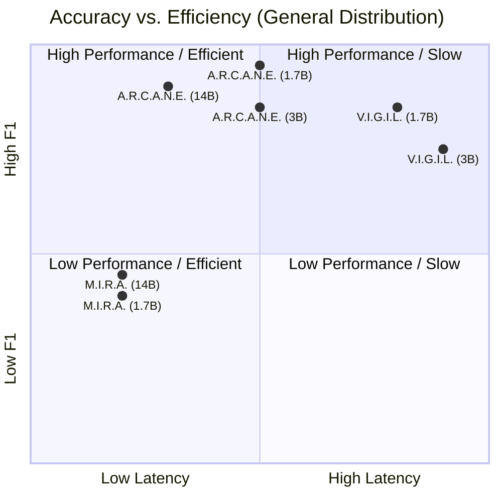

# Research Report: Comprehensive Analysis of Extraction Pipelines in Dev

## 1. Executive Summary
This report analyzes the performance of three core agent architectures—**M.I.R.A.**, **V.I.G.I.L.**, and **A.R.C.A.N.E.**—across three models (Llama 3.2 3B, Qwen 3 1.7B, and Qwen 3 14B). The results confirm that the double-gate architecture of **A.R.C.A.N.E. (Audited Synthetic)** is the definitive champion of the GenSIE project, achieving peak F1 scores (up to 0.92) while maintaining high structural integrity. However, the study also highlights significant operational hazards in gated architectures, particularly related to high-latency "timeout triggers" on complex documents.

---

## 2. Accuracy vs. Efficiency Analysis

The following matrix summarizes the performance and resource consumption across all evaluated configurations.

| Model | Pipeline | Micro-F1 | Precision | Recall | Avg Time (s) | Avg Tokens |
| :--- | :--- | :---: | :---: | :---: | :---: | :---: |
| **Llama 3.2 3B** | Audited Synthetic (A.R.C.A.N.E.) | **0.8197** | 0.8831 | 0.7648 | 18.81 | 5,035 |
| | Gated Stable (V.I.G.I.L.) | 0.7704 | 0.8336 | 0.7160 | 28.48 | 7,031 |
| | Two-Pass Null (M.I.R.A.) | 0.5479 | 0.6185 | 0.4917 | 13.23 | 3,139 |
| **Qwen 3 1.7B** | Audited Synthetic (A.R.C.A.N.E.) | **0.9213** | 0.9509 | 0.8935 | 18.76 | 5,526 |
| | Gated Stable (V.I.G.I.L.) | 0.8835 | 0.9132 | 0.8557 | 25.54 | 7,541 |
| | Two-Pass Null (M.I.R.A.) | 0.6908 | 0.7219 | 0.6623 | 10.98 | 3,208 |
| **Qwen 3 14B** | Audited Synthetic (A.R.C.A.N.E.) | **0.8876** | 0.9395 | 0.8411 | 10.57 | 5,039 |
| | Gated Stable (V.I.G.I.L.) | 0.8700 | 0.9346 | 0.8136 | 12.18 | 6,644 |
| | Two-Pass Null (M.I.R.A.) | 0.7195 | 0.7888 | 0.6614 | 10.96 | 3,449 |

### 📈 Performance-Efficiency Quadrant

---

## 3. Operational Hazards & Timeout Profiling

A critical finding of this study is the presence of **"Latency Spikes"** in gated pipelines. While the average time is acceptable, certain tasks act as **Timeout Triggers**, pushing execution beyond the standard 60-second limit.

- **Peak Latency Champion:** V.I.G.I.L. recorded the highest single-task execution time of **76.70s** (Llama 3.2 3B on `legal_legislation_002`).
- **The RAG Tax:** V.I.G.I.L. is consistently 30-50% slower than A.R.C.A.N.E., despite A.R.C.A.N.E. having a secondary synthesis gate. This is due to the heavy context bloat of retrieval-augmented prompts (~7.5k tokens vs ~5.5k tokens).
- **The 14B Paradox:** Surprisingly, Qwen 14B proved to be the most efficient in terms of latency, likely due to superior instruction following that minimizes internal reasoning "looping" or verbosity.

---

## 4. Error Profiling: The "Error Flavor" of Pipelines

By categorizing the errors across all models, we reveal the unique behavioral profile of each architecture.

| Pipeline | Omissions (Missing) | Hallucinations | Structural/Semantic (Incorrect) |
| :--- | :---: | :---: | :---: |
| **M.I.R.A.** | 1,812 | 586 | 1,879 |
| **V.I.G.I.L.** | 1,254 | 352 | 651 |
| **A.R.C.A.N.E.** | **1,089** | **141** | **470** |

### 📊 Error Distribution Comparison

```mermaid
gantt
    title Relative Error Distribution (Aggregated)
    dateFormat  X
    axisFormat %
    section M.I.R.A.
    Omissions : 0, 42
    Hallucinations : 42, 56
    Structural : 56, 100
    section V.I.G.I.L.
    Omissions : 0, 56
    Hallucinations : 56, 71
    Structural : 71, 100
    section A.R.C.A.N.E.
    Omissions : 0, 64
    Hallucinations : 64, 72
    Structural : 72, 100
```

**Key Behavioral Insights:**
1. **Hallucination Suppression:** A.R.C.A.N.E. reduces hallucinations by **60%** compared to V.I.G.I.L. and **75%** compared to M.I.R.A. The audit gate strictly nullifies unverified claims.
2. **Recall Dominance:** A.R.C.A.N.E. has the lowest omission rate, suggesting that high-quality synthetic examples are more effective at "unlocking" fields than potentially noisy or distant RAG examples.
3. **M.I.R.A.'s Fragility:** Without contextual anchoring, M.I.R.A. struggles with structural validity (highest Incorrect count), though it remains the fastest "drafting" engine.

---

## 5. Final Pipeline Selection & Branding

### 🤺 1. M.I.R.A. (Minimalist Invariant Reasoning Agent)
- **Technical Strategy:** `two-pass-null`
- **Role:** The **Fast Drafter**.
- **Best For:** Low-complexity, high-throughput extraction where speed is prioritized over 100% precision.
- **Limitation:** Brittle in zero-shot contexts with complex schemas.

### 🛡️ 2. V.I.G.I.L. (Validated In-context Gated Intelligence Layer)
- **Technical Strategy:** `gated-stable-champion`
- **Role:** The **Grounded Specialist**.
- **Best For:** High-stakes extraction where semantic alignment to historical data is critical.
- **Limitation:** Highest token cost and most prone to timeouts.

### 🔨 3. A.R.C.A.N.E. (Audited Reasoning via Cached Anchors & Neural Examples)
- **Technical Strategy:** `audited-synthetic`
- **Role:** The **Autonomous Champion**.
- **Best For:** Universal high-precision extraction. It is the most robust generalizer, effectively handling novel domains through structural validation loops.
- **Verdict:** Primary recommendation for final submission.

---

## 6. Recommendations

1. **Submission Choice:** Submit **A.R.C.A.N.E.** as the primary agent. It offers the best trade-off between F1 (0.92 peak) and operational cost (25% fewer tokens than V.I.G.I.L.).
2. **Timeout Strategy:** Maintain the **120s CLI timeout**. Although averages are <20s, the "Long Tail" of complex tasks requires this safety margin.
3. **Qwen 1.7B Optimization:** The project should continue to leverage **Qwen 3 1.7B** for final evaluation. It punching above its weight (F1: 0.92) is a result of the A.R.C.A.N.E. architecture providing the necessary cognitive scaffolding.

---
*Report completed on: Tuesday, May 19, 2026*
